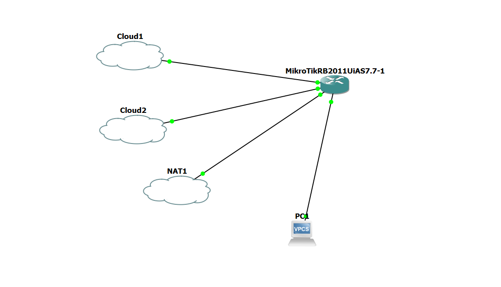

# 🌐 محاكاة شبكة MikroTik باستخدام بيئة GNS3

مشروع محاكاة لشبكة توجيه متكاملة باستخدام بيئة GNS3، يوضح كيفية ربط وتكوين موجهات MikroTik في بيئة افتراضية للتعامل مع الشبكات السحابية والأجهزة الطرفية.

## 📸 مخطط الشبكة (Network Topology)

## 🛠️ التقنيات والأدوات المستخدمة
* **بيئة المحاكاة:** GNS3 لإدارة وبناء هيكل الشبكة الوهمية[cite: 12].
* **الموجه الرئيسي (Router):** MikroTik RouterOS (RB2011UiAS إصدار 7.7)[cite: 12].
* **أداة الإدارة:** WinBox للتحكم والتكوين وتطبيق سياسات التوجيه[cite: 13].
* **الأجهزة الطرفية (End Devices):** استخدام (VPCS) لتمثيل أجهزة المستخدمين مثل (PC1) لاختبار الاتصال[cite: 12].
* **الربط الخارجي:** استخدام العقد السحابية (Cloud1, Cloud2) وعقدة (NAT1) لمحاكاة الاتصال بالإنترنت والشبكات الخارجية[cite: 12].

## ⚙️ تفاصيل الإعدادات
يحتوي هذا المستودع على ملف التكوين الأساسي الذي تم تصديره عبر واجهة WinBox. يشمل الإعداد:
- تكوين واجهات الربط مع الـ Clouds والـ NAT.
- إعداد عناوين IP والتوجيه (Routing) لاختبار الاتصال بين الأطراف.

## 📂 محتويات المستودع
* `Network_Config.rsc`: السكربت البرمجي المستخرج الذي يحتوي على كامل إعدادات راوتر مايكروتيك.
* `topology.png`: صورة توضح هيكل الشبكة المعمارية المنفذة في GNS3.
